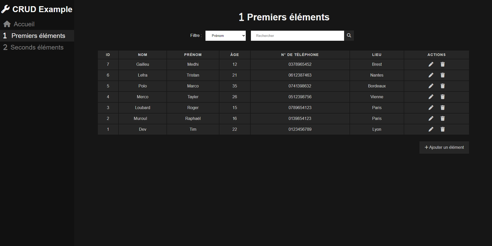

<h2>CRUD Example</h2>

Exemple d'interface CRUD en PHP



__Fonctionnalités :__

<li>Création d'éléments</li>
<li>Modification d'éléments</li>
<li>Suppression d'éléments</li>

<br>

__Utilisation :__

Importez le fichier __crud.sql__ sur votre base de données à l'aide de votre outil favori ou créez le vôtre si vous voulez partir de 0 sur cette interface et modifier le code en conséquence

Dans le fichier __config/database.php__ changez ces 4 lignes avec les identifiants de connexion à votre base de données

```
$host = "localhost";
$bdd = "crud";
$user = "root";
$passwd = "";
```

<br>

__Modification :__

Pour modifier les éléments à afficher dans l'interface modifiez un fichier par exemple `first/index.php` et changez ces lignes pour définir les éléments à afficher sur le tableau

```html
<tr>
    <th scope="col">ID</th>
    <th scope="col">Nom</th>
    <th scope="col">Prénom</th>
    <th scope="col">Âge</th>
    <th scope="col">N° de téléphone</th>
    <th scope="col">Lieu</th>
    <th scope="col">Actions</th>
</tr>
```

Choisissez le nombre total d'élément à afficher par page

```php
$total = 12;
```

Modifiez aussi les requêtes pour changer le nom de la table utilisée


```php
$requete = "SELECT * FROM first [...] $total;
```


Modifiez aussi les éléments qui vont s'afficher depuis la base de données

```php
while($row = $resultat->fetch()){
    $id = html_entity_decode($row['id']);
    $first_name = html_entity_decode($row['first_name']);
    $last_name = html_entity_decode($row['last_name']);
    $age = html_entity_decode($row['age']);
    $phone = html_entity_decode($row['phone']);
    $area = html_entity_decode($row['area']);

    echo "<tbody>
    <tr>
    <td data-label='ID'>$id</td>
    <td data-label='Last Name'>$last_name</td>
    <td data-label='First Name'>$first_name</td>
    <td data-label='Age'>$age</td>
    <td data-label='Phone'>$phone</td>
    <td data-label='Area'>$area</td>
    <td data-label='Actions'>
    <a href='edit?id=$id' class='edit'><i class='fa-solid fa-pen table-icon'></i></a>
    <a href='delete?id=$id' class='delete'><i class='fa-solid fa-trash table-icon'></i></a>
    </td>
    </tr>
    </tbody>";
}
```

Modifiez aussi les éléments des fichier `add/index.php` et `edit/index.php` (n'oubliez pas les requpetes de base de données et les values pour la page d'édition)

```html
<form action="add.php" method="POST">
    <label>Nom</label><br>
    <input type="text" name="last_name" placeholder="Nom" required><br>
    <label>Prénom</label><br>
    <input type="text" name="first_name" placeholder="Prénom" required><br>
    <label>Âge</label><br>
    <input type="number" name="age" placeholder="Âge" min="1" required><br>
    <label>N° de téléphone</label><br>
    <input type="text" name="phone" placeholder="N° de téléphone" required><br>
    <label>Lieu</label><br>
    <input type="text" name="area" placeholder="Lieu" required><br>
    <button type="submit" class="table-button add"><i class="fa-solid fa-plus"></i> Ajouter l'élément</button>
</form>
```

Et pour terminer modifiez les requêtes en conséquences dans les fichier `add/add.php`, `edit/edit.php` et `delete/index.php`

Vous pouvez aussi rajouter des éléments via le menu de navigation (active étant la page actuelle)

```html
<div class="sidenav">
    <h1><i class="fa-solid fa-wrench title-icon"></i> CRUD Example</h1>
    <a href="../" class="link"><i class="fa-solid fa-house navbar-icon"></i>Accueil</a>
    <a class="active"><i class="fa-solid fa-1 navbar-icon"></i> Premiers éléments</a>
    <a href="../second" class="link"><i class="fa-solid fa-2 navbar-icon"></i>Seconds éléments</a>
</div>
```

<br>

__Test du projet :__

Utilisez un logiciel de wamp tel que [Wamp server](https://www.wampserver.com/) par exemple
<br>
Mettez le dossier du projet dans le dossier __www__ du logiciel de Wamp et lancer le projet depuis votre navigateur web
<br><br>
Vous pouvez aussi l'hoster sur votre propre site web/serveur

<br>

__Crédits :__

Banque d'icônes utilisées : <a href='https://fontawesome.com'>Font Awesome</a>
